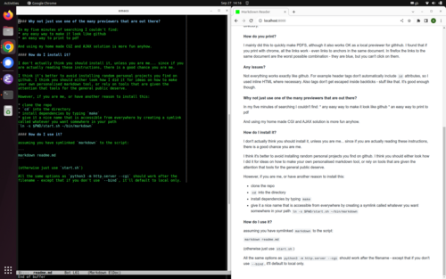

# Markdown Reader

I made this while I was working on my cv a few years ago (in markdown) so that
I could print it out. Then when I needed a cv again, I found it on one of my
computers and decided to put it on github so that I could always find it, and
change it around a bit so that I could install it on my computer and open any
markdown file with it any time.



## FAQ

<small>
	I have used FAQ format for this readme
</small>

#### What does it do?

It basically just combines a python library to
[convert markdown to html](https://pypi.org/project/Markdown/)
and an npm library with css to 
[make it look like github](https://www.npmjs.com/package/github-markdown-css)

#### How does it do it?

The cool thing about it is it uses
[CGI](https://en.wikipedia.org/wiki/Common_Gateway_Interface)

So it rerenders the markdown every request. So you just have to refresh the
browser to see the latest version.

Python-Markdown can do this:

```
import markdown
html = markdown.markdown(your_text_string)
```

but instead I just wrapped the
[command line tool](https://python-markdown.github.io/cli/)
in a [shell script](web/cgi-bin/index.sh)

In order to include the CSS - the markdown that has been converted to css is
ajaxed on every request like [this](./web/index.html). This is also handy
because the python test cgi server doesn't seem to allow scripts anywhere but
the `cgi-bin` directory.

#### How do you print?

I mainly did this to quickly make PDFs, although it also works OK as a local
previewer for githhub.  I found that if you print with chrome, all the links
work - even links to anchors in the same document. In firefox the links to the
same document are the worst possible combination - they are blue, but you can't
click on them.

#### Any issues?

Not everything works exactly like github. For example header tags don't
automatically include `id` attributes, so I used inline HTML where necessary.
Also tags don't get escaped inside backticks - stuff like that.
It's good enough though.

##### images

Also, it doesn't show images. The main html file is in the web directory, so
if you link to an image, it won't show it. I only realised that when I included
the screenshot above. Since I am only using this as a preview for github, I
can live with it for this, and for my cv, I don't have any pictures on it. If
I ever want to include a picture of my cv that I have in a local file, I'll
have to fix it or work around it.

#### Why not just use one of the many previewers that are out there?

In my five minutes of searching I couldn't find:
* any easy way to make it look like github
* an easy way to print to pdf

and then one thing led to another...

#### How do I install it?

I don't actually think you should install it, unless you are me... since if you
are actually reading these instructions, there is a good chance you are me.

I think it's better to avoid installing random personal projects you find on
github. I think you should either look how I did it for ideas on how to make
your own personalised markdown tool, or rely on tools that are given the
attention that tools for the general public deserve.

However, if you are me, or have another reason to install this:

* clone the repo
* `cd` into the directory
* install dependencies by typing `make`
* give it a nice name that is accessible from everywhere by creating a symlink
called whatever you want somewhere in your path
`ln -s $PWD/start.sh ~/bin/markdown`

#### How do I use it?

assuming you have symlinked `markdown` to the script:

```
markdown readme.md
```

(otherwise just use `start.sh`)

All the same options as `python3 -m http.server --cgi` should work after the
filename - except that if you don't use `--bind`, it'll default to local only.
